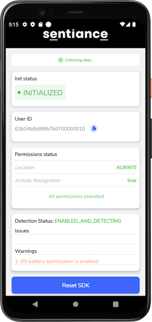

# Sample Android Application

This is a sample application to demonstrate how to integrate the Sentiance Android SDK.

## What's in this?

In this sample application we cover the SDK Integration (and SDK user creation) - with [user linking](https://docs.sentiance.com/important-topics/user-linking-2.0)

## Where to Start?

There are two places you need to look at

1. `initializeSentianceSdk` in the `MainApplication.kt`
2. `createUserAndEnableDetections` in the `UserCreationActivity.kt`

## To run this project:

1. Request a developer account by [contacting Sentiance](mailto:support@sentiance.com).
2. Setup your backend to provide authentication code to Application. See: [**sample api server**](https://github.com/sentiance/sample-apps-api)
3. Open this repository with Android Studio.
4. In `app/build.gradle`: update the Sentiance SDK dependency version to the latest one shown [here](https://docs.sentiance.com/sdk/changelog/android).
5. Update the `BACKEND_BASE_URL` in `app/src/main/java/com/sentiance/sdksampleapp/helpers/AuthCodeAPI.kt` to get authentication code from your server.
6. Using Android Studio, run the application on your device.

## More info

- [Full documentation on the Sentiance SDK](https://docs.sentiance.com/)